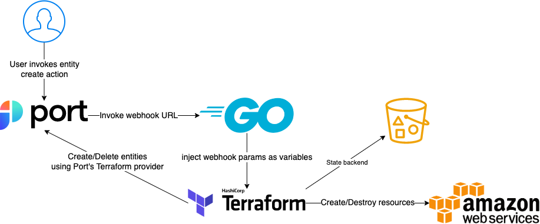
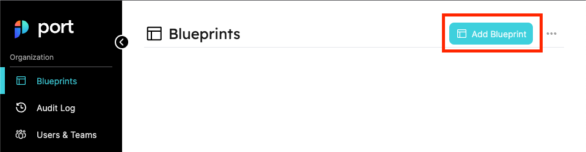

# Introduction

This repository is an example of how to implement a webhook for Port for creation and deletion of developer resources (i.e. s3 buckets, sns topics, etc).  
It uses a simple web server that gets webhook requests from Port (see [docs](https://docs.getport.io/platform-overview/self-service-actions/setting-self-service-actions-in-port)) and applies user inputs to Terraform files. You can fork this repository to extend its core functionality or add more templates as your use-case requires.

## Architecture Diagram



This web server is an example for how to use Port's webhooks to create and destroy resources using terraform.  
It uses terraform files as templates and applies user supplied parameters from Port. When a user calls an action on Port (say, `create bucket`) and fills in the inputs (e.g. `name`, `tags`) the parameters are passed to this server which applies them upon the terraform files and then calls `terraform apply`.  
  
There are two terraform files used for every request:
1. `main.tf` which is located in the root of this repository, and contains the base configuration for every call to this web server. Notice the following conventions:
    1. We use S3 backend to store the state information of terraform. This is because this application is stateless and we need to store terraform state in a permanent storage. You can replace S3 with another backend of your choice.
    1. The key to the state file is injected by the web server by replacing `key = "{{ .storage_key }}"`. This way we can control which request is associated with which request (typically a destroy operation needs to use the state of the create operation, but create operations start with no state)
    1. The following variables are injected by the web server on each request:
        * `blueprint` - this is the identifier of the blueprint associated with the action
        * `entity_identifier` - this is the identifier of the entity on which we performed the action (in case of a create operation this will be generated by the web server to control the id of the entity)
        * `run_id` - this is the identifier of the action run, used to associate entities with the run who created them.
1. `templates/<blueprint_id>.tf` - the template for each blueprint may be different. For example - `s3_bucket.tf` is a template used for actions on `s3_bucket` blueprint and `sns_topic.tf` is a template used for actions on `sns_topic` blueprint. each template can define different variables (which are supposed to match the action user inputs). a standard template will create both the resource and the associated entity for Port.  
Each time the web server gets a request it loads `main.tf` and `templates/<bluepprint>.tf` and saves them in a temp directory. Then, it creates a terraform var file with the user inputs from Port and calls `terraform apply`.

## Example setup (S3 bucket)

The following will walk you through how to set up Port actions to create, change ACL (Day-2 operation), and delete S3 buckets (a similar flow is required for resources on other clouds).
>**_NOTE:_**  
>For this tutorial you'll need:
>1. an AWS account with permissions to create S3 buckets
>1. an account in [PORT](https://getport.io)

First, we want to run this web server and make it public for Port.  
To make your local machine public to Port you can use either [ngrok](https://ngrok.com/) or [smee](https://smee.io/).  
In the following example I'll use ngrok, run:
```shell
ngrok http 8080
```
and you should get a forwarding URL:
```shell
ngrok

Session Status                online                                                                                       
Account                       <Account Name>                                                                                                        
Version                       3.1.0                                                                                             
Region                        Europe (eu)                                                                    
Latency                       68ms                                                                                                                           
Web Interface                 http://127.0.0.1:4040                                                                       
Forwarding                    https://1234-5678-9101-112-1314-1516-abcd-efgh-ijkl.eu.ngrok.io -> http://localhost:8080           
                                                                                                                
Connections                   ttl     opn     rt1     rt5     p50     p90                                                                
                              79      0       0.00    0.00    4.91    31.99                                               
```
Keep the forwarding URL and we will use it later.  
  
Next, we will deploy this project as a docker container, run the following:
```shell
docker run \
  -e PORT_CLIENT_ID=<PORT_CLIENT_ID> \            
  -e PORT_CLIENT_SECRET=<PORT_CLIENT_SECRET> \
  -e AWS_ACCESS_KEY_ID=<AWS_ACCESS_KEY_ID> \
  -e AWS_SECRET_ACCESS_KEY=<AWS_SECRET_ACCESS_KEY> \
  -e AWS_SESSION_TOKEN=<AWS_SESSION_TOKEN> \
  -e DEBUG=true \
  -p 8080:8080 \
  -it hedwigz/webhook-terraform:v0.1
```
Now we have a running server that gets webhook request from Port and applies them to terraform files!  
  
Next, let's set up a blueprint for an S3 bucket on Port. This can be achieved by using the web ui or using the [Port's terraform provider](https://docs.getport.io/integrations/terraform). We will stick to the web ui for now - go to Blueprints page and create a new blueprint



You can create how many properties you wish to see on each bucket, but for this example we will keep it lean with four properties - `URL`, `Bucket Name`, `Bucket ACL` and `Tags`.
Enter the following JSON:
```json
{
  "identifier": "s3_bucket",
  "title": "AWS Bucket",
  "icon": "Bucket",
  "schema": {
    "properties": {
      "url": {
        "type": "string",
        "title": "URL",
        "format": "url"
      },
      "bucket_name": {
        "type": "string",
        "title": "Bucket Name"
      },
      "bucket_acl": {
        "type": "string",
        "title": "Bucket ACL",
        "default": "private"
      },
      "tags": {
        "type": "object",
        "title": "Tags"
      }
    },
    "required": [
      "url",
      "bucket_name"
    ]
  },
  "mirrorProperties": {},
  "formulaProperties": {},
  "relations": {}
}
```
Press the `save` button and you should see the Bucket blueprint added to the screen:

Next, we want to create an action that will create buckets from the UI. For this, expand the AWS Bucket blueprint and press the `Edit actions` button:

Then, paste the following action configuration:
> **_NOTE:_**  replace `<your ngrok forwarding URL>` with the URL you got earlier
```json
[
    {
        "identifier": "create_bucket",
        "title": "Create Bucket",
        "icon": "Bucket",
        "userInputs": {
            "properties": {
                "bucket_name": {
                    "type": "string",
                    "title": "Name for the S3 bucket"
                },
                "tags": {
                    "type": "object",
                    "title": "Tags",
                    "default": {}
                }
            },
            "required": [
                "bucket_name"
            ]
        },
        "invocationMethod": {
            "type": "WEBHOOK",
            "url": "<your ngrok forwarding URL>"
        },
        "trigger": "CREATE",
        "description": "Create a new S3 Bucket in AWS"
    }
]
```

It's time to test our action, go to `AWS Buckets` page on Port and trigger the `CREATE` action:


Fill in the form and press `Create`:

This will trigger the webhook which will pass the action parameters to the forwarding URL which will forward the request to our web server. Then, our web server will apply the parameters to the terraform files and call `terraform apply` which will create the bucket for us, and update port that the action succeeded and create an entity of that bucket.  
Similarly, to support destroy and change ACL operations, add the following action configuration:
```json
{
  "identifier": "change_acl",
  "title": "Change ACL",
  "icon": "Bucket",
  "userInputs": {
    "properties": {
      "bucket_acl": {
        "type": "string",
        "enum": [
          "private",
          "public-read"
        ],
        "title": "ACL"
      }
    },
    "required": [
      "bucket_acl"
    ]
  },
  "invocationMethod": {
    "type": "WEBHOOK",
    "url": "<forwarding_url>"
  },
  "trigger": "DAY-2",
  "description": "Change S3 Bucket ACL"
}
```
```json
{
    "identifier": "delete_bucket",
    "title": "Delete Bucket",
    "icon": "Bucket",
    "userInputs": {
        "properties": {},
        "required": []
    },
    "invocationMethod": {
        "type": "WEBHOOK",
        "url": "<forwarding_url>"
    },
    "trigger": "DELETE",
    "description": "Delete an S3 Bucket from AWS"
}
```

